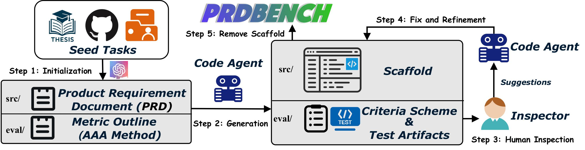

# PRDbench

PRDBench is a benchmark designed to evaluate code agents, particularly in the context of automated software development using large language models (LLMs). With the advent of tool-equipped agents, LLMs can read large amounts of files and conduct extensive analyses, offering new possibilities for evaluation. PRDBench aims to address the limitations of existing benchmarks, particularly the lack of clear evaluation criteria and comprehensive assessment capabilities for code agents.



## Features

- 🤖 **Agent-as-a-Judge**: Use the Agent-as-a-Judge paradigm for evaluation, enabling flexible human-like question-and-answer assessments.

- ⚙️ **Structured Criteria**: Provide structured criteria and tools to make evaluations more robust.

- 💻 **Real Software Projects**: Design executable and complex tasks suitable for real software projects.

- ✨ **Simplified Annotation Process**: Significantly reduce annotation complexity, allowing annotators with basic knowledge to complete tasks.

## Requirements

- Python 3.10+
- Conda environment manager


## 🚀 Quick Start

### 1. Download PRDBench and Develop by Your CodeAgent

#### Data Format
PRDBench provides a comprehensive dataset for evaluating code agents. Each task is organized under a `{task_id}/` directory containing:

- **PRD Location**: `{task_id}/src/PRD.md` - Contains the Product Requirements Document with detailed task specifications and requirements
- **Test Plan**: `{task_id}/evaluation/detailed_test_plan.json` - Contains comprehensive test cases and evaluation criteria

When running the evaluation, your CodeAgent should:
1. Read the `{task_id}/src/PRD.md` file to understand the task requirements
2. Analyze the `{task_id}/evaluation/detailed_test_plan.json` to understand the expected functionality and test cases
3. Implement the corresponding interfaces and code based on these specifications

#### CodeAgent Development
To develop and debug your CodeAgent, you can find the prompt templates in `prompt.py`:
- `DEVELOPMENT_PROMPT` - For initial task understanding and planning
- `DEBUG_PROMPT` - For troubleshooting and optimization

#### Using Your Own LLM
If you want to use your own LLM instead of the default configuration, you can apply our minimal code agent framework. Visit our repository for integration details: [Minimal Code Agent Repository](https://github.com/fulingyue/Minimal-CodeAgent)

### 2. Create Conda Environment

```bash
# Create a conda environment named evalADK with Python 3.10
conda create -n evalADK python=3.10 -y

# Activate the environment
conda activate evalADK
```

### 3. Install Dependencies

```bash
# Navigate to the project directory
cd PRDBench

# Install project dependencies
pip install -r requirements.txt
```

### 4. Configure API Keys

Edit the `Evaluation/adk_example/code_eval_agent/config.py` file and replace the following configurations:

```python
# Replace with your model name, actual API keys and base URLs
"your_model_name": LiteLlmWithSleep(
        model="openai/gpt-5", # your model
        api_base='https://api.example.com/v1/openai/native', # api base url
        api_key='your-api-key-here', # api key
        max_tokens_threshold=64000,
        enable_compression=True,
        temperature=0.1
)
```

Edit the `Evaluation/adk_example/code_eval_agent/mcp_config.py` file and replace in line 744:

```python
# Replace with your VLLM model name, actual API keys and base URLs
api_key = 'https://api.example.com/v1/openai/native'
        api_base = 'your-api-key-here'
        model_name = "model_name"
```

### 5. Evaluation
```
bash Evaluation/Evaluation_infer.sh \
  MODEL_NAME \
  ROOT_PATH \
  PORT \
  PYTHON_INTERPRETER_PORT \
  FILE_OPERATIONS_PORT \
  SYSTEM_OPERATIONS_PORT\
  source_dir
```

**Script Options:**
- `MODEL_NAME`: the name of the model to be used in the evaluation.
- `ROOT_PATH`: the base directory for storing evaluation files.
- `PORT`,`PYTHON_INTERPRETER_PORT`,`FILE_OPERATIONS_PORT`,`SYSTEM_OPERATIONS_PORT`: port numbers for various services and operations. Before using these ports, ensure they are not already occupied by other services to avoid conflicts.

Finally, you can see result_{round}.json generated under the corresponding path in workspace

## Development Guide

### Project Structure

```
PRDBench/
├── EvalAgent/                        # EvalAgent code directory
│   ├── agent.py                      # Main agent program
│   ├── config.py                     # Configuration file
│   ├── mcp_servers.py                # MCP server implementation
│   ├── mcp_tools.py                  # MCP tool functions
│   └── start.sh                      # Start agent script
├── Evaluation/
│   ├── Evaluation_infer.sh               # Start evaluating script
│   ├── generate_code.py                  # Main interaction code
├── requirements.txt                  # Dependencies list
└── README.md                         # Project documentation
```


## License

This project is licensed under the MIT License.

## Contributing

Issues and Pull Requests are welcome!

## Contact

If you have any questions, please contact us through:

- Submit a GitHub Issue
- Send an email to the project maintainers

## Acknowledgments

This project is built on the [Google Agent Development Kit (ADK)](https://google.github.io/adk-docs/), which provides the foundational framework for agent development. We thank the Google ADK team for creating this excellent framework that makes agent development more accessible and modular.

---

**Note**: Please ensure that API keys and security settings are properly configured in production environments to avoid exposing sensitive information.